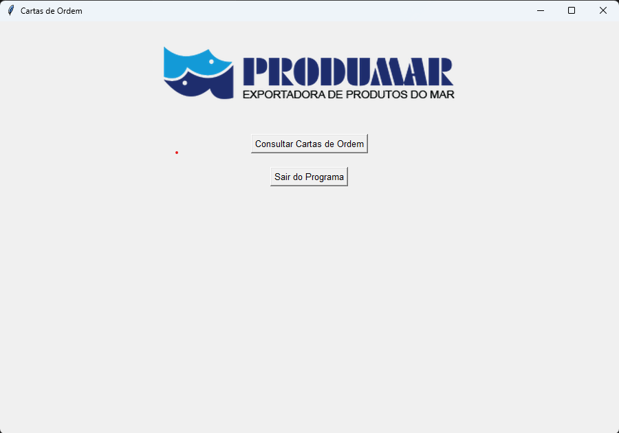
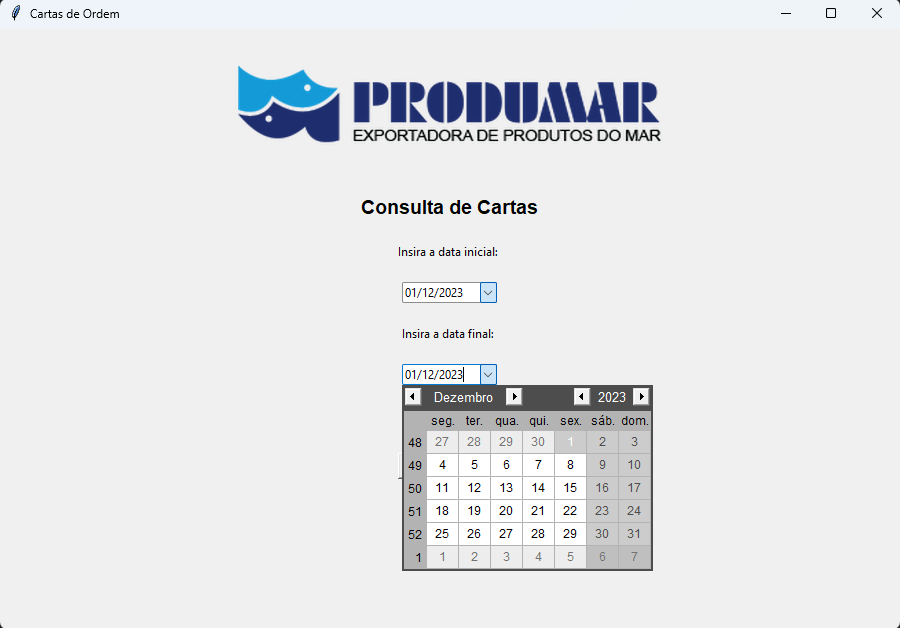
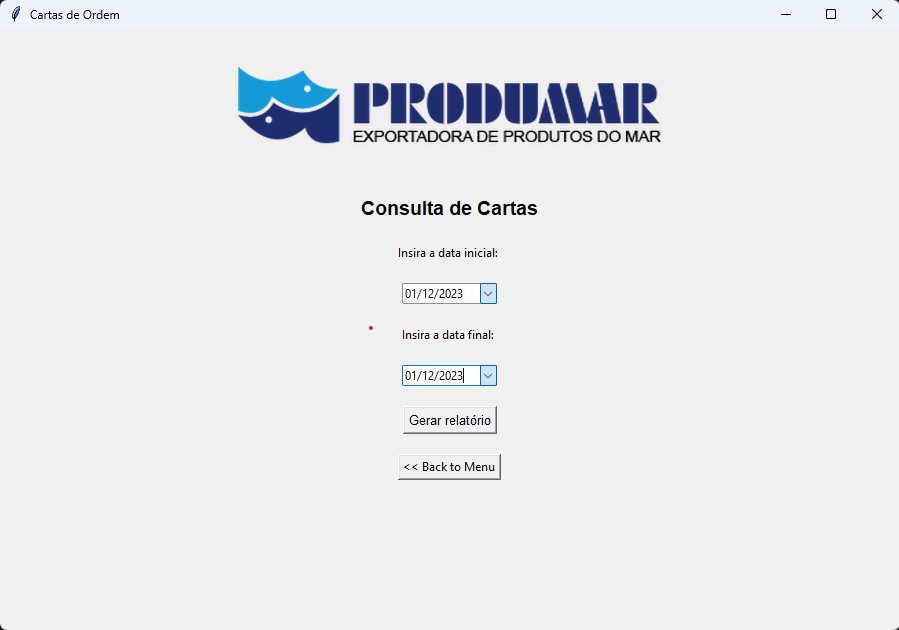

<h1>Basic Consult Tkinter</h1>

<section align="center">
 <h2>Description</h2>
  

    Projeto iniciado devido a necessidade de fazer uma consulta personalizada de forma períodica ao database do ERP da empresa. Visando o conforto visual do usuário e a eliminação de qualquer possibiidade de entradas erradas no terminal, optei por fazer esse script atuar de forma visual, assim busquei a solução via Tkinter, aliado com algumas outras libs especificas para deixar o programa mais enxuto possivel. 
  

</section>

<section align="center">
  <h2>Visual</h2>
  
  

    Aqui temos o a tela inicial de menu composta apenas da opção de sair e de fazer a consulta.
  

  
  

    Ao entrar no menu temos a seleção da data para a consulta dos dados que foi feita usando uma box de calendario, feita com o tkcalendar e DateEntry. 
  

  
  

    Por fim, temos após a seleção das datas inicial e final, o botão de gerar relatório e de voltar ao menu para realizar o encerramento do programa.  
  

</section>

<section align="center">
  <h2>Author</h2>
  

    Silas Eduardo
     
    linkedin: www.linkedin.com/in/silaseduardo
     
    github: https://github.com/Silas-ER
  

</section>

